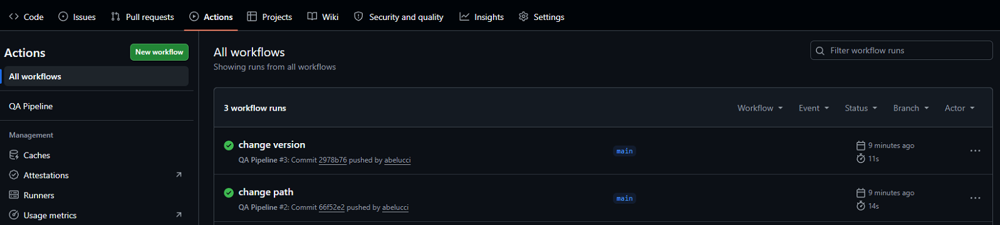
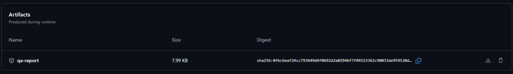

# AUT STEP BY STEP

Crear el pipeline, en la siguiente ruta:

`.\github\workflows\tucodigo.yml`

Luego al realizar un push, por ejemplo, se dispara automáticamente el test. Para verificarlo ir a:

 

Por último, verificar el artefacto generado:

 
